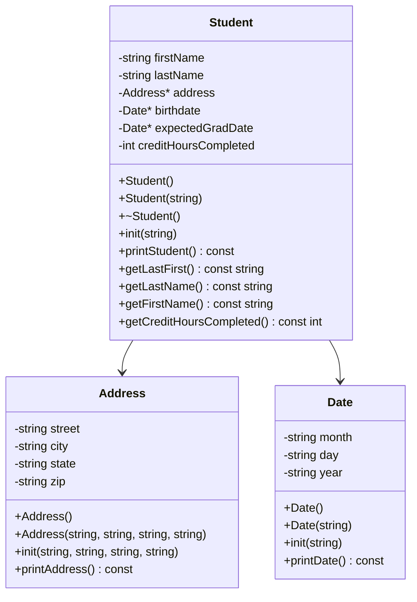

# Heap-of-Students

## Overview
This program loads students from `students.csv` into a vector, then lets you print names, view all info, search by last name, and sort the records.

- Load students from file
- Print all names (`Last, First`)
- Print full student details
- Search students by last name
- Sort by last name, first name, or credit hours (highest first)
- Delete all students on quit
