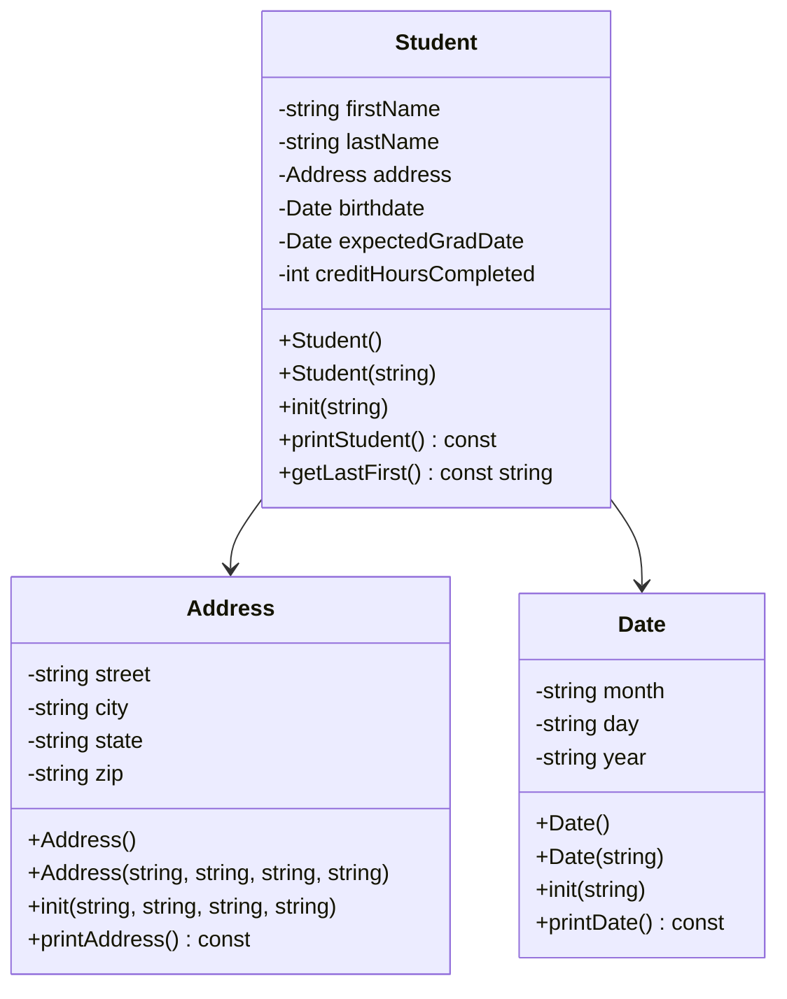

# Heap-of-Students

```mermaid
classDiagram
class Date {
  -string month
  -string day
  -string year
  +Date()
  +Date(string)
  +init(string)
  +printDate() const
}

class Address {
  -string street
  -string city
  -string state
  -string zip
  +Address()
  +Address(string, string, string, string)
  +init(string, string, string, string)
  +printAddress() const
}

class Student {
  -string firstName
  -string lastName
  -Address address
  -Date birthdate
  -Date expectedGradDate
  -int creditHoursCompleted
  +Student()
  +Student(string)
  +init(string)
  +printStudent() const
  +getLastFirst() const string
}

Student --> Address
Student --> Date
```

